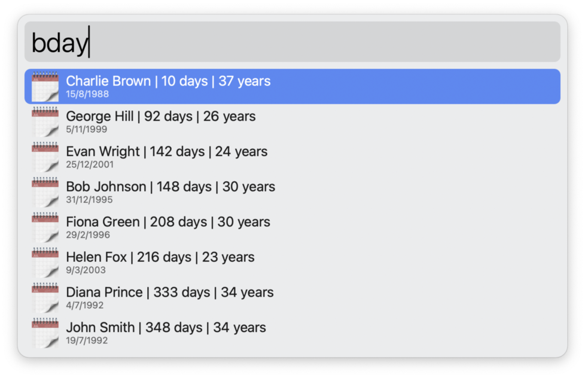

# 🎂 Alfred Birthdays Workflow

A simple Alfred workflow to manage birthdays stored in a CSV file.




## 🔧 Main Features

- **`bday`** – search for birthdays by name  
	- Press `Shift + Enter` on a result to delete it.
- **`add bday John Doe,9/3/2003`** – add a new person
- **`edit bday`** – open `birthdays.csv` in text editor for bulk editing

## 📂 File format

Birthdays are stored in a file named `birthdays.csv`, located in the workflow's directory. Name and date are **comma-separated**. The date format is flexible – it supports different separators: `/`, `-`, or `.`. Each line must follow one of this formats:

```csv
name,date
John Doe,9/3/2003
John Doe,9-3-1990
John Doe,9.3.1990
```


<details>
<summary>This is an example of valid file content</summary>
</br>
<ul style="list-style-type: none">
<li>
<code style="display: block; white-space: pre-wrap">name,date
Alice Smith,1/1/2000
Bob Johnson,31/12/1995
Charlie Brown,15-8-1988
Diana Prince, 4.7.1992
Evan, 25/12/2001
George,5/11/1999
</code>
</li>
</ul>

</details>

## 📦 Installation

Install Alfred Birthdays Workflow from the repository.
